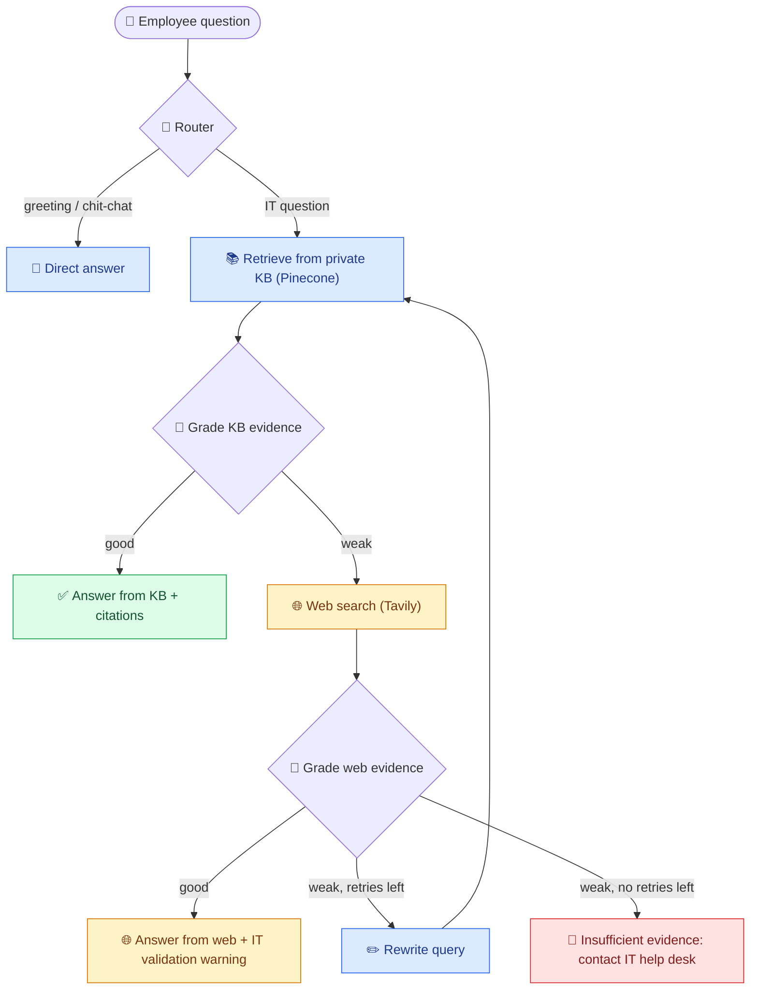

<div align="center">

# 🛠️ IT Support Agentic RAG Copilot

### An AI helpdesk that **routes, retrieves, grades its own evidence, falls back to the web, and shows its work.**

[](https://end-to-end-it-support-agentic-rag-copilot.onrender.com/)
[](https://end-to-end-it-support-agentic-rag-copilot.onrender.com/api/health)


> ⏳ **Heads-up:** the demo runs on a free instance that sleeps when idle. The first load can take up to a minute. After that it's fast.

</div>

---

## 📑 Contents
[Problem](#-the-problem) · [Solution](#-the-solution) · [How it works](#-how-it-works) · [Features](#-features) · [Screenshots](#-screenshots) · [Tech stack](#-tech-stack) · [Run locally](#-run-locally) · [API](#-api) · [Docker & deploy](#-docker--deployment) · [Security](#-security) · [Roadmap](#-roadmap) · [Author](#-author)

---

## 🎯 The Problem

Every company's IT helpdesk answers the same questions all day: *VPN won't connect, reset my password, set up MFA on a new phone, request software access.*

| 😩 Pain point | 💥 Why it hurts |
|---|---|
| Repeat tickets | Most questions are the same, but each one is solved by hand |
| Scattered knowledge | Policies live in PDFs, wikis and emails, so nobody knows where to look |
| Plain LLM chatbots | They don't know your policies and **hallucinate** confident, wrong IT steps |
| Basic RAG | Searches the KB once, then answers from weak matches or says nothing useful |

## 💡 The Solution

An **agentic RAG** copilot. It doesn't just search and answer. It **decides, checks its own evidence, and refuses honestly** when it isn't sure.

- 🧭 **Routes** each message: IT question or small talk
- 📚 **Retrieves** from the company's private knowledge base
- 🧪 **Grades** whether the evidence is actually good enough
- 🌐 **Falls back** to web search only when the KB is weak
- ✏️ **Rewrites** the query and retries before giving up
- 🛑 **Says "I don't know"** and points to the IT help desk when evidence is insufficient
- 🔍 **Shows its work**: source badge, citations and a step-by-step trace on every answer

---

## 🧠 How it works



| Step | What happens | Why it matters |
|---|---|---|
| 🧭 **Router** | The LLM classifies the message as `kb` or `direct` | Small talk never triggers a search |
| 📚 **Retrieve** | Embeds the question and pulls the top-k chunks from Pinecone | Answers come from your real documents |
| 🧪 **Grade** | The LLM judges evidence as `good` or `weak` | Weak evidence never becomes a confident answer |
| 🌐 **Web fallback** | Tavily search, graded the same way | Covers gaps in the KB, clearly labelled as external |
| ✏️ **Rewrite** | Adds technical keywords and retries (`MAX_RETRIES`) | Helps vague questions find the right chunks |
| 🛑 **Insufficient** | Honest refusal | No hallucinated policy |

---

## ✨ Features

- 🤖 **LangGraph agent** with conditional routing, evidence grading and a retry loop
- 🎨 **Source badges**: 🔵 Company KB · 🟠 Web search · 🔴 Not enough evidence
- 🧾 **Reasoning trace timeline** on every answer, so you can see each step the agent took
- 🔗 **Citations**: private KB file names and clickable web links
- 📤 **Admin document upload**: parse → chunk → embed → index into Pinecone from the UI
- 🗂️ **Audit log** of every question, source used and trace (SQLite)
- 🌗 **Responsive UI** with light/dark theme, copy-answer button and persistent chat history
- 🔒 **Hardened API**: admin-key auth, upload size limit, security headers, no internal error leaks
- 🐳 **Dockerized** and deployed on Render

---

## 📸 Screenshots

<table>
  <tr>
    <td align="center"><b>🔵 Answer from Company KB</b><br></td>
    <td align="center"><b>🟠 Web search fallback</b><br></td>
  </tr>
  <tr>
    <td align="center"><b>🧾 Reasoning trace</b><br></td>
    <td align="center"><b>📤 Admin upload</b><br></td>
  </tr>
</table>

---

## 🧰 Tech stack

| Layer | Tools |
|---|---|
| 🧠 **Agent orchestration** | LangGraph, LangChain |
| 💬 **LLM** | Groq (`openai/gpt-oss-120b` by default) |
| 🧲 **Embeddings** | `sentence-transformers/all-MiniLM-L6-v2` (384 dimensions) |
| 🗄️ **Vector database** | Pinecone |
| 🌐 **Web search** | Tavily |
| ⚙️ **Backend** | FastAPI, Uvicorn, Pydantic Settings |
| 🎨 **Frontend** | HTML, CSS, vanilla JavaScript |
| 🗂️ **Storage** | SQLite (audit log) |
| 🐳 **Ops** | Docker, Render |

<details>
<summary><b>📁 Project structure</b></summary>

```
├── app/
│   ├── api/routes.py          # /api/health, /api/chat, /api/ingest
│   ├── core/                  # settings, logging
│   ├── rag/
│   │   ├── state.py           # agent state + structured outputs
│   │   ├── vectorstore.py     # Pinecone + embeddings
│   │   └── workflow.py        # the LangGraph agent
│   ├── services/
│   │   ├── ingestion.py       # load + chunk documents
│   │   └── audit.py           # SQLite audit log
│   └── main.py                # FastAPI app, middleware, static + template
├── data/                      # sample knowledge base documents
├── static/                    # css/ and js/
├── templates/index.html       # chat UI
├── tests/
├── ingest_sample_kb.py        # one-shot sample KB loader
├── run.py
├── Dockerfile
└── requirements.txt
```
</details>

---

## 🚀 Run locally

**1. Clone and install**
```bash
git clone https://github.com/omkar834-droidk/End-To-End-IT-Support-Agentic-RAG-Copilot.git
cd End-To-End-IT-Support-Agentic-RAG-Copilot
python -m venv venv
venv\Scripts\activate          # macOS/Linux: source venv/bin/activate
pip install -r requirements.txt
```

**2. Create a `.env` file** in the project root
```env
GROQ_API_KEY=your_groq_key
TAVILY_API_KEY=your_tavily_key
PINECONE_API_KEY=your_pinecone_key
PINECONE_INDEX_NAME=fde-it-support
PINECONE_NAMESPACE=company-it-kb
ADMIN_API_KEY=a_long_random_string
GROQ_MODEL=openai/gpt-oss-120b
TOP_K=4
MAX_RETRIES=1
```
> 🔑 Generate an admin key: `python -c "import secrets; print(secrets.token_urlsafe(32))"`
> 🌲 The Pinecone index must use **384 dimensions** to match the embedding model.

**3. Load the sample knowledge base**
```bash
python ingest_sample_kb.py
```

**4. Start the server**
```bash
uvicorn app.main:app --reload
```
Open **http://localhost:8000** 🎉

---

## 🔌 API

| Method | Endpoint | Auth | Description |
|---|---|---|---|
| `GET` | `/api/health` | none | Service status |
| `POST` | `/api/chat` | none | Ask a question |
| `POST` | `/api/ingest` | `X-Admin-Key` header | Upload and index a document |

**Chat**
```bash
curl -X POST https://end-to-end-it-support-agentic-rag-copilot.onrender.com/api/chat \
  -H "Content-Type: application/json" \
  -d '{"question": "How do I reset my password?"}'
```
```json
{
  "answer": "...",
  "source_used": "private_kb",
  "trace": ["Router → KB", "Private KB retrieval → 4 chunks", "KB evidence grade → GOOD", "Answer generation → PRIVATE KB"],
  "citations": [{"title": "it_handbook.md", "url": "", "type": "private_kb"}],
  "rewritten_query": "How do I reset my password?"
}
```
`source_used` is one of `private_kb`, `web_search`, `direct` or `insufficient_evidence`.

**Ingest** (admin only)
```bash
curl -X POST http://localhost:8000/api/ingest \
  -H "X-Admin-Key: $ADMIN_API_KEY" \
  -F "file=@policy.pdf"
```

---

## 🐳 Docker & deployment

```bash
docker build -t it-copilot .
docker run -p 8080:8080 --env-file .env it-copilot
```
Open **http://localhost:8080**.

The Dockerfile installs **CPU-only PyTorch** (keeps the image small) and bakes the embedding model into the image so cold starts don't re-download it.

**Live deployment:** Render (Docker web service). Set the same variables from the `.env` above in the Render dashboard (API keys as secrets) and use `/api/health` as the health check path.

> 💾 The audit log and uploaded files live on the instance's local disk, which is ephemeral on free hosting. The knowledge base itself is stored in Pinecone and persists.

---

## 🔒 Security

- 🔑 Document upload is **disabled unless `ADMIN_API_KEY` is set**, and the key is compared in constant time
- 🙈 Internal errors are logged server-side. Users only see a generic message.
- 📏 20 MB upload limit, file-type allow-list, sanitized file names
- 🛡️ Security headers and a strict Content-Security-Policy
- 🧼 Chat answers are HTML-escaped before rendering
- 🔐 Secrets live in `.env` (git-ignored), never in the image or repo

---

## ⚠️ Known limitations

- Chat is **stateless**: each question is answered independently, so follow-ups like "and on Mac?" have no context yet
- The evidence grader is an LLM, so it can be wrong. A labelled evaluation set is on the roadmap.
- Web results are external and unverified. Answers built from them carry a validation warning.

## 🗺️ Roadmap

- [ ] ⚡ Streaming responses with a live trace (SSE)
- [ ] 🧵 Conversation memory
- [ ] 📊 Evaluation set with routing, grading and groundedness metrics
- [ ] 👍 User feedback loop and an admin dashboard for KB gaps
- [ ] 🎫 Ticket escalation when evidence is insufficient
- [ ] 💬 Slack / Microsoft Teams integration
- [ ] 🔎 Hybrid search and reranking

---

## 👨‍💻 Author

**Omkar Salunke**
B.Sc. Computer Science (AI & Data Science), SPPU · Pune, India · Looking for AI / ML Engineer roles

[](https://github.com/omkar834-droidk)
[](https://linkedin.com/in/omkar-salunke-712696351)
[](mailto:salunkeomkar834@gmail.com)

<div align="center">

⭐ If this project helped or inspired you, give it a star!

</div>
